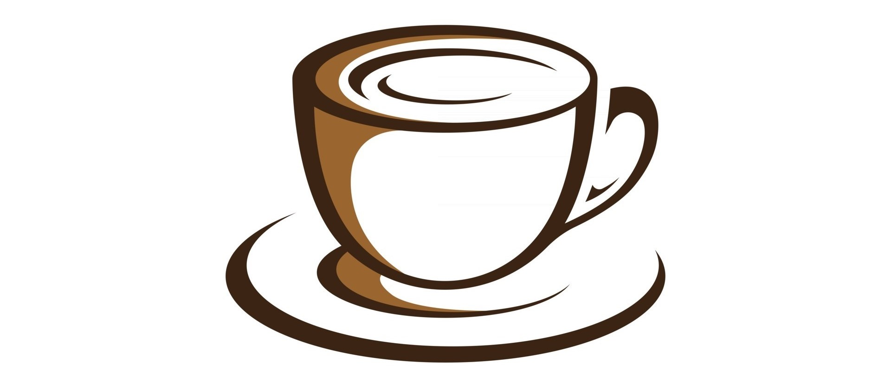

# brewie

## Table of Contents

- [Overview](#overview)
  
## Overview

After getting a coffee-making machine there are a lot of situations in which the extracted coffee does not end up to our expectations. Some of us enjoy a balanced taste with slight bitterness while others prefer to drink a slightly acid coffee. Considering this, the idea of developing an ML-based system, that could aid the extraction process, specifically providing tips for adjusting parameters from _grind size_, _coffee quantity_ and _extraction time_ up to _coffee origin_, in order to achieve the desired coffee taste.
 

<a href="https://www.vecteezy.com/free-vector/cappuccino">Cappuccino Vectors by Vecteezy</a>
